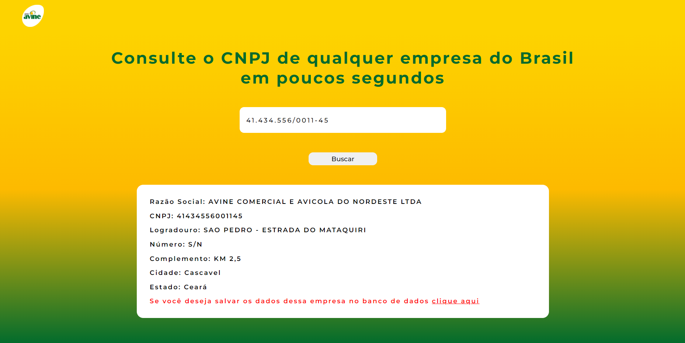
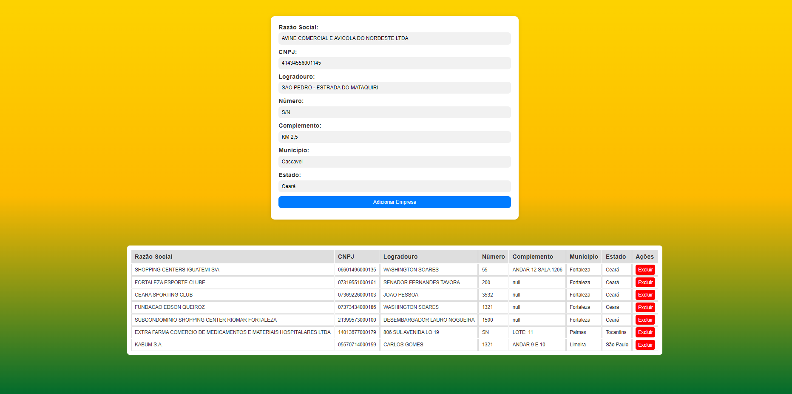

**LINK DEPLOY REACT : https://pesquisa-cnpj-phi.vercel.app/**

Para rodar o projeto React -->  

 

**PORTA PADRÃO : 3000** 

<ul>
  <li>npm i</li>
  <li>npm run dev</li>
  <li>ALTERAR PORTA LOCALHOST DO PROJETO ASP PARA O LINK REDIRECIONAR CORRETAMENTE</li>
</ul>
 

**PORTA PADRÃO DO SITE: 5000** 

Para rodar o projeto ASP --> 

 

<ul>
  <li>Instalar ODBC do Banco escolhindo **(Caso decida manter o my SQL instale o MySQL ODBC 8.3 ANSI Driver)**</li>
  <li>Criar site no Gerenciador de Servidor</li>
  <li>Apontar endereço fisico para o index.asp do projeto</li>
  <li>Criar documento padrão "index.asp"</li>
</ul> 

$**VOU DEIXAR MEU BANCO DE DADOS ONLINE PARA FACILITAR NOS TESTES** 
 
$**Caso queira mudar o Banco de Dados, lembre-se de alterar a ConnectionString** 

SCRIPT DE CRIAÇÃO DA TABELA NO BANCO DE DADOS  
 
------------------> MySQL <------------------ 
 
create table empresa ( 
    ID_EMPRESA INT AUTO_INCREMENT PRIMARY KEY, 
    NM_RAZAO_SOCIAL VARCHAR(255) NOT NULL, 
    NR_CNPJ VARCHAR(14) UNIQUE NOT NULL, 
    NM_LOGRADOURO VARCHAR(255), 
    NR_NUMERO VARCHAR(10), 
    DS_COMPLEMENTO VARCHAR(255), 
    NM_MUNICIPIO VARCHAR(100), 
    NM_ESTADO VARCHAR(100), 
    created_at TIMESTAMP DEFAULT CURRENT_TIMESTAMP, 
    updated_at TIMESTAMP DEFAULT CURRENT_TIMESTAMP ON UPDATE CURRENT_TIMESTAMP 
); 
